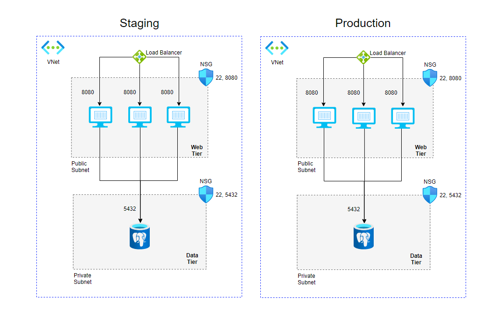
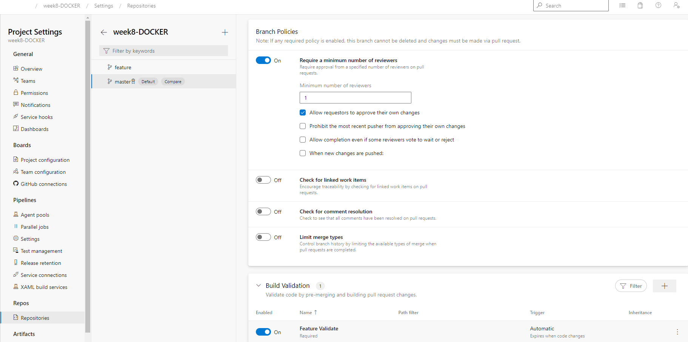
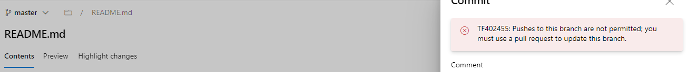
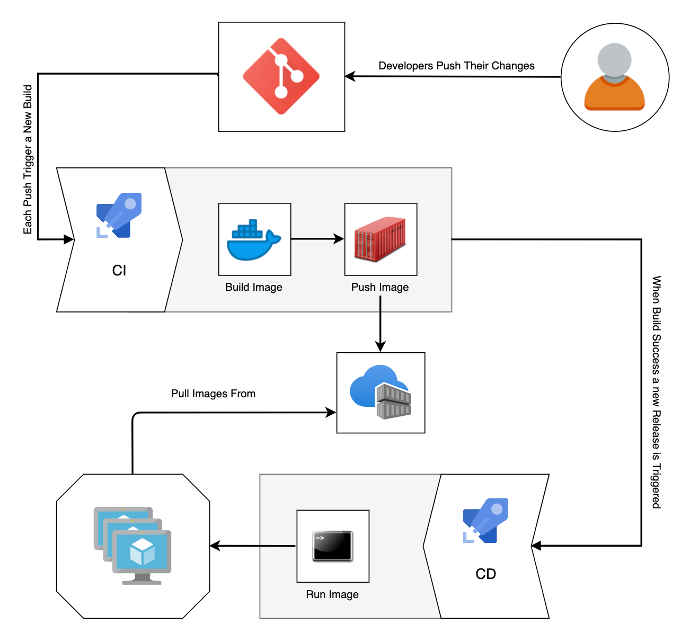
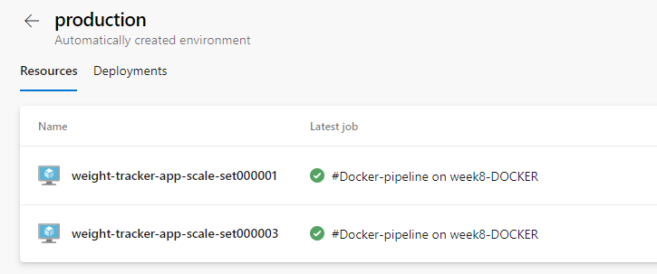
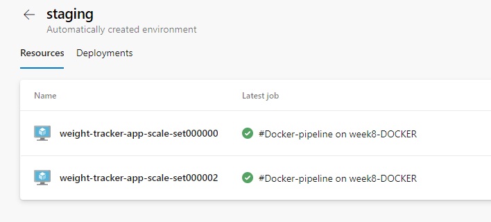
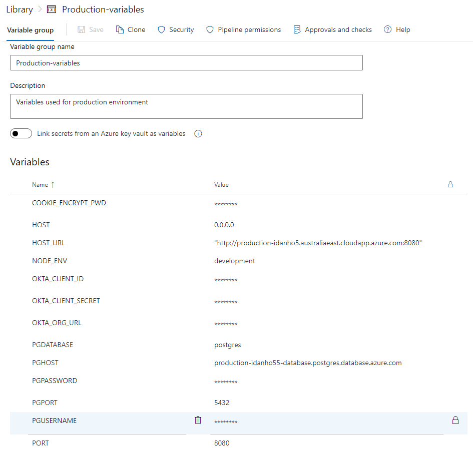
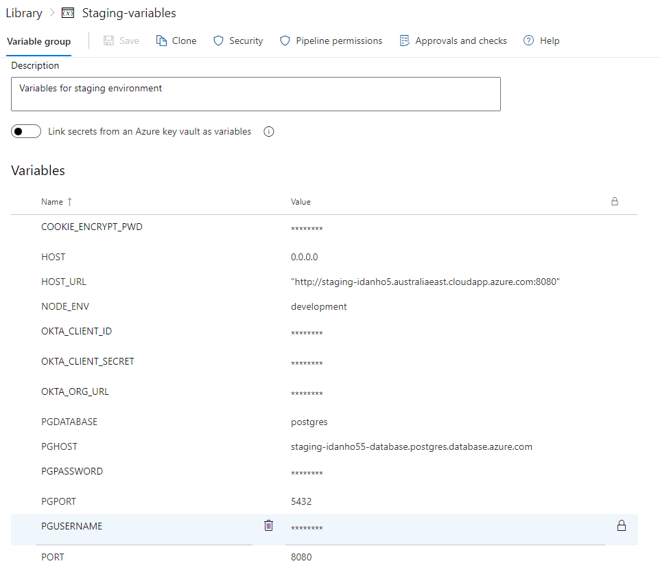
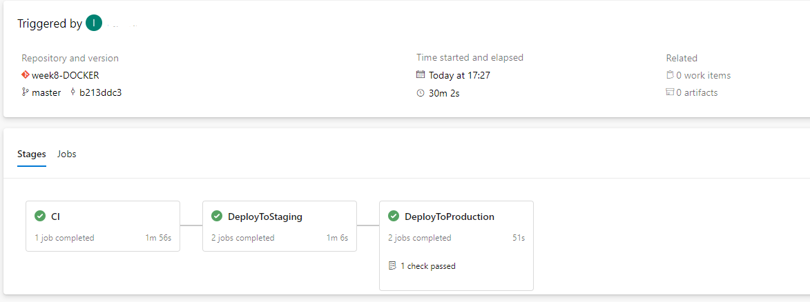

# Node.js Weight Tracker

## Deployed using Docker & Azure DevOps


# Overview

Up until now we automated the process of provisioning the infrastructure for our WeightTracker application and we
configured a whole CI/CD process to manage it. However, when we packaged the application to create our build artifact we
used a zip file which contains only the application and it’s dependencies. By using containers we will be able to
package the application together with its runtime so the deployment process and the operations after it will we much
easier.

# Project Overview

This week’s project consists on writing a Dockerfile to package your NodeWeightTracker application into an image and
configure a CI/CD process to automate the deployment. However this week we will raise the level a bit to achieve a CI/CD
process that complies with best practices and implement the practice of Pipeline as Code.

Regarding the architecture of our solution we will keep the same infrastrucutre but this time we will run the
application as a container:



In this project we will manage the code of our application using one of the most common and simple Git workflow usually
called the “Feature Branch Workflow” in which branches named with the prefix “feature/” are used to work on the code
independently and then the code is integrated into the master/main branch to be deployed in the target environments.


To optimize the worflow you will need to configure a branch policy for the master/main branch to enforce Code Review by
using Pull Requests and a Build Validation Policy to ensure that the changes are ok before integrating them.





Finally, the CI/CD process must the following requirements:

For Feature Branches:

Whenever a new change is pushed to a feature branch this should start the CI pipeline that will take the Dockerfile from
the repository and build an image to ensure that everything is ok (note that we don’t want to push it to the registry
since we have not yet reached the integration branch, our only objective is to provide the developer with an indication
of whether their code is correct or not).

For Master/Main Branch:

Whenever a new change is pushed to the main/master branch this should start the CI process that will take the Dockerfile
from the repository, build an image and push it to a container registry (Azure ACR).
Then the CD consists on pulling the image from the registry and deploying it into the staging environments
automatically (Continuous Deployment) and then wait for approval to deploy into the Production environment (Continuous
Delivery)



Last but not least, you should configure your pipelines using Yaml pipelines to implement the “Pipeline as Code”
practice. In this case you will need a single pipeline (instead of a Build Pipeline and a Release Pipeline) but that
uses different stages to separate the processes and integrates with the “Environments” feature so that, among other
things, you can configure approvals for the stage that deploy to production. Your pipeline should look something like
this:

```Yaml
name: Docker-pipeline

trigger:
- master
- feature/*

pool:
  name: { Your agent pool name }}

stages:

# Continuous Integration Process
- stage: CI
  jobs:
  - job: Build
    steps:
    - task: CmdLine@2
      displayName: Install docker and set permissions
      inputs:
        script: 'curl -fsSL https://get.docker.com -o get-docker.sh && chmod u+x get-docker.sh && ./get-docker.sh && sudo chmod 666 /var/run/docker.sock && sudo chown ubuntu:docker /var/run/docker.sock'

    - task: Docker@2
      displayName: Push image
      inputs:
        containerRegistry: { Your container registry name }
        repository: { Your container repository name }
        command: 'buildAndPush'
        Dockerfile: { Your Dockerfile path }

# Continuous Deployment Process for Staging Environment
- stage: DeployToStaging
  condition: and(succeeded(), eq(variables['build.sourceBranch'], 'refs/heads/master'))
  variables:
    - group: "Your variables group name"
  jobs:
  - deployment: staging
    displayName: Deploy to Staging
    environment:
      name: staging
      resourceType: VirtualMachine
    strategy:
      runOnce:
        deploy:
          steps:
            - template: { Your template path }
          
# Continuous Delivery Process for Production Environment
- stage: DeployToProduction
  condition: and(succeeded(), eq(variables['build.sourceBranch'], 'refs/heads/master'))
  variables:
    - group: { Your variables group name }
  jobs:
   - deployment: production
     displayName: Deploy to Production
     environment:
       name: production
       resourceType: VirtualMachine
     strategy:
       runOnce:
         deploy:
           steps:
             - template: { Your template path }
```

# Environments

 

# Variable groups

 


# Project Goals

Write a Dockerfile for your NodeWeightTracker application and add it to the application’s repository.
Configure a branch policy to avoid commiting to the master/main branch directly forcing code review and build
validations.
Write a CI/CD pipeline that uses the Dockerfile to package your application into an image, push it to Azure Container
Registry and deploy it into the target environments (automatically to Staging and after approval to Production).
Ensure your pipeline is totally configured with yaml (pipeline as code)

# Expected Result

A Dockerfile to package the NodeWeightTracker application into an image.
Branch policies to force code review and build validation configured for the master/main branch
A CI/CD pipeline to automate the application lifecycle
Images stored on Azure Container Registry (ACR)
CI/CD implementing the principle of “Pipeline as Code” by using Yaml with multiple stages




# Application configuration

This sample application demonstrates the following technologies.

* [hapi](https://hapi.dev) - a wonderful Node.js application framework
* [PostgreSQL](https://www.postgresql.org/) - a popular relational database
* [Postgres](https://github.com/porsager/postgres) - a new PostgreSQL client for Node.js
* [Vue.js](https://vuejs.org/) - a popular front-end library
* [Bulma](https://bulma.io/) - a great CSS framework based on Flexbox
* [EJS](https://ejs.co/) - a great template library for server-side HTML templates

**Requirements:**

* [Node.js](https://nodejs.org/) 12.x or higher
* [PostgreSQL](https://www.postgresql.org/) (can be installed locally using Docker)
* [Free Okta developer account](https://developer.okta.com/) for account registration, login

## Install and Configuration

1. Clone or download source files
1. Run `npm install` to install dependencies
1. If you don't already have PostgreSQL, set up using Docker
1. Create a [free Okta developer account](https://developer.okta.com/) and add a web application for this app
1. Copy `.env.sample` to `.env` and change the `OKTA_*` values to your application
1. Initialize the PostgreSQL database by running `npm run initdb`
1. Run `npm run dev` to start Node.js

The associated blog post goes into more detail on how to set up PostgreSQL with Docker and how to configure your Okta
account.
